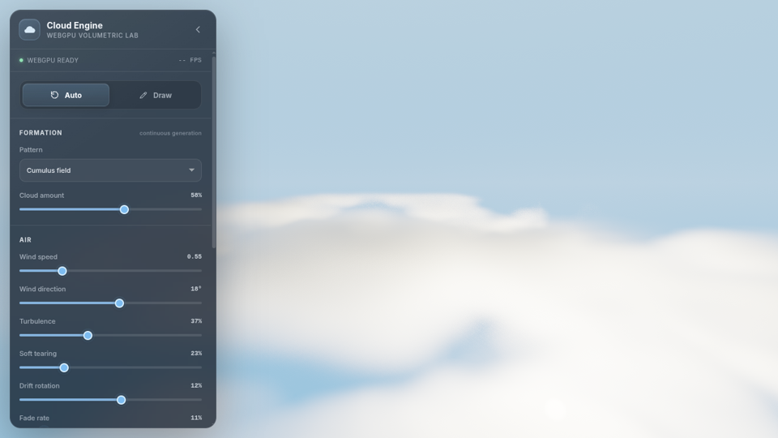

# Cloud Engine — WebGPU Artistic + TRUEOS-aligned Native Edition

A focused cloud renderer and editable 3D density simulation for the browser. It fills the screen with clouds, exposes a compact control panel, supports direct mouse painting, and now carries a native compatibility contract shaped specifically around TRUEOS's existing Shell2 C++ for OpenCL + Intel IGC + direct-RCS execution path.

This consolidated package contains the complete application. No manual file replacement is required.



## Run

WebGPU shader modules are fetched over HTTP, so do not open `index.html` through `file://`.

```bash
cd cloud-engine-webgpu-linux-aligned
python3 serve.py --open
```

Then open:

```text
http://localhost:8080/
```

There is no npm install, package manager, build step, bundler, framework, or CDN dependency.

## Main features

- Fullscreen WebGPU cloud renderer with no scene geometry.
- Ping-pong 3D `rgba16float` density simulation.
- Seven procedural formations:
  - Cumulus field
  - Layered deck
  - High wisps
  - Storm towers
  - Broken cells
  - Moon scrolls
  - Wind ribbons
- Continuous Auto mode with cloud-amount control.
- Draw mode for adding and erasing cloud density directly in the scene.
- Correct full-canvas pointer-to-volume mapping, including the lower half of the frame.
- Painting while paused.
- World-space spherical brush with size, strength, and depth controls.
- Wind translation, turbulence, soft tearing, drift rotation, fading, and stylized curl/ribbon flow.
- Realistic volumetric rendering and a separate artistic moon-scroll renderer.
- Collapsible responsive HTML/CSS control panel.
- Free-fly camera with pointer-lock mouse look and WASD movement.
- Sun color, direction, intensity, exposure, and quality controls.
- PNG capture.
- Versioned JSON export/import for every panel value, the camera pose, pause state, and procedural seed.
- TRUEOS-aligned C++ for OpenCL compute twins, SIMD16 dispatch plan, and matching C++ parameter layouts under `native/`.

## Artistic mode

Select **Artistic moon-scroll** under **Look**. It adds an art-directed rendering path inspired by sculpted, curling painted clouds rather than applying a simple color grade to the realistic result.

Controls include:

- Verdant moon, blue porcelain, amber dusk, violet night, and custom palettes.
- Independent cloud, shadow, sky, and moon colors.
- Curl-field strength.
- Ribbon stretch.
- Sculpted-body response.
- Quantized toon-lighting bands.
- Ink-like cloud edges.
- Moon angular size and glow.
- Print grain.

The **Moon scrolls** and **Wind ribbons** formations are designed for this mode, but every formation can be rendered with either style.

## Interaction

| Input | Action |
| --- | --- |
| `Space` | Pause/resume cloud simulation |
| `H` | Collapse/expand control panel |
| `C` | Clear density volume |
| `F` | Enter or leave flycam |
| Double-click canvas in Auto mode | Enter flycam |
| Mouse in flycam | Look around |
| `W A S D` | Fly forward, left, backward, right |
| `Q / E` | Fly down/up |
| `Shift` in flycam | Speed boost |
| `Esc` | Release pointer lock |
| Left-drag in Draw mode | Add cloud density |
| `Shift` + drag or right-drag | Erase cloud density |
| Mouse wheel in Draw mode | Change brush depth |

The camera can move while the simulation is paused. Leaving flycam returns the canvas to drawing interaction when Draw mode is active.

## JSON configuration export and load

The **Configuration** section at the bottom of the panel has two controls:

- **Export JSON** downloads one readable, versioned configuration file.
- **Load JSON** validates that file, clamps numeric values to the current UI ranges, applies every setting, restores the camera pose and pause state, and restarts the volume from the saved procedural seed.

The document identifies itself with:

```json
{
  "format": "cloud-engine-config",
  "version": 1,
  "engineVersion": "2.1-config-io",
  "configuration": {
    "mode": "auto",
    "formation": {},
    "look": {},
    "air": {},
    "brush": {},
    "camera": {},
    "sunAndRender": {},
    "playback": {}
  }
}
```

The exported groups contain every current panel control:

- formation mode, pattern, amount, and seed;
- realistic/artistic selection, palette colors, curl, ribbon, sculpt, bands, outline, moon, and grain controls;
- all air, brush, camera, sun, exposure, quality, and pause values;
- the live fly-camera position, yaw, and pitch, even though those are moved with the mouse and keyboard rather than sliders.

Color values are stored as sRGB `#RRGGBB` strings. Wind direction, sun angles, and field of view are degrees. Camera yaw and pitch are radians. The remaining scalar values use the same units and ranges as the panel and native parameter preparation in `app.js`.

The JSON is deliberately a **configuration handoff**, not a 3D texture dump. The mutable `96 × 48 × 96` density volume and hand-painted voxel contents are not embedded. Loading therefore starts a clean procedural volume in Auto mode and an empty volume in Draw mode.

## Architecture

### Compute simulation

`shaders/simulate.wgsl` dispatches one invocation per voxel over a `96 × 48 × 96` volume. Two textures alternate roles:

```text
volume A --sample--> simulation kernel --write--> volume B
volume B --sample--> simulation kernel --write--> volume A
```

Each voxel stores advected density and supporting procedural/noise channels. The **browser** simulation uses fixed `4 × 4 × 4` workgroups and ordinary sampled/storage textures. That workgroup geometry is no longer presented as the native ABI: the TRUEOS-aligned C++ target flattens the same volume into SIMD16 rows.

### Browser renderer

`shaders/render.wgsl` emits a fullscreen triangle from `vertex_index`; there are no mesh or vertex-buffer dependencies. The fragment stage ray marches the cloud AABB.

The realistic path includes extinction, short sun-light marches, anisotropic phase response, powder/silver-lining behavior, ambient contribution, tone mapping, and dithering.

The artistic path adds a procedural moon, sculpted density response, lighting quantization, outlines, palette control, and grain while sampling the same editable 3D volume.

### Native / TRUEOS-aligned renderer

The native target is under `native/trueos/` and uses **C++ for OpenCL** rather than the earlier generic OpenCL-image sketch. Both kernels require a `16 × 1 × 1` local size and an Intel SIMD16 subgroup.

The simulation uses two persistent linear `half4` buffers and flattens the `96 × 48 × 96` voxel domain into `27,648 × 1 × 1` SIMD16 groups. The renderer uses `ceil(width / 16) × height × 1` groups and writes packed RGBA8 directly into a linear destination, matching the shape of the existing TRUEOS Shell2 C++ producer path.

For the first compatibility contract, volume filtering is software trilinear. This deliberately avoids requiring TRUEOS sampler/image support before we can establish mathematical parity. Hardware 3D sampling remains a later performance upgrade.

## Portability contract

| Role | Browser / Linux visual reference | TRUEOS execution reference | Host ABI |
| --- | --- | --- | --- |
| Simulation | `shaders/simulate.wgsl` | `native/trueos/cloud_simulation.clcpp` | `SimParams` |
| Render | `shaders/render.wgsl` | `native/trueos/cloud_render.clcpp` | `RenderParams` |
| Scheduling | WebGPU command encoder | `native/cloud_dispatch_plan.hpp` + TRUEOS RCS encoder | retained A/B volumes |

Current ABI sizes remain:

```text
SimParams:    112 bytes
RenderParams: 272 bytes
```

The intended TRUEOS frame is `simulation walker -> GPU dependency -> render walker -> one final completion marker`. The CPU should not poll between stages. See [`PORTING.md`](PORTING.md), [`native/README.md`](native/README.md), and [`native/trueos/README.md`](native/trueos/README.md).

The original image-object OpenCL C twins are retained under `native/reference_opencl_c/` only as a mathematical reference; they are no longer the recommended production port shape.

## Validation

Run the static checks with:

```bash
./verify.sh
```

They cover:

- JavaScript syntax.
- Python helper syntax.
- C++ for OpenCL syntax for both TRUEOS-aligned SIMD16 kernels.
- OpenCL C syntax for the historical image-object reference twins.
- C++20 ABI, dispatch geometry, and retained-volume-size assertions.

The optional browser smoke test is:

```bash
python3 tests/smoke_test.py
```

A configuration-only browser test that does not need localhost or WebGPU is also included:

```bash
python3 tests/config_io_test.py
```

The full smoke test requires Playwright/Chromium and an environment that permits browser access to localhost; it now includes the JSON round-trip after its rendering and interaction checks. The configuration-only test also requires Playwright/Chromium, but it does not need localhost or WebGPU and still performs an actual download, edits every major configuration group, loads the file through the UI, and verifies the result.

## Source map

```text
index.html                  interface and overlays
styles.css                  responsive dependency-free UI
app.js                      WebGPU host, flycam, drawing, controls, and JSON configuration I/O
shaders/simulate.wgsl       3D cloud compute simulation
shaders/render.wgsl         realistic + artistic fullscreen renderer
serve.py                    no-dependency localhost server
verify.sh                   static validation entry point
PORTING.md                  native/SPIR-V/IGC architecture notes
native/cloud_params.hpp                 matching C++ parameter ABI
native/cloud_dispatch_plan.hpp          TRUEOS SIMD16 two-stage dispatch geometry
native/trueos/cloud_simulation.clcpp    canonical native simulation kernel
native/trueos/cloud_render.clcpp        canonical native render kernel
native/reference_opencl_c/              historical generic image-object math reference
native/abi_check.cpp                    layout/dispatch verification executable
native/CMakeLists.txt                   ABI-check CMake target
tests/smoke_test.py         optional full WebGPU browser interaction test
tests/config_io_test.py     browser JSON round-trip test without a local server
assets/                     preview media
```

## Scope

This is an engine nucleus rather than a pressure-projected meteorological solver. The air field is analytic and art-directable; the lighting is physically inspired rather than a spectral atmospheric reference integrator. The implementation intentionally prioritizes visual quality, controllability, direct editing, and a clean native-compute migration path.
